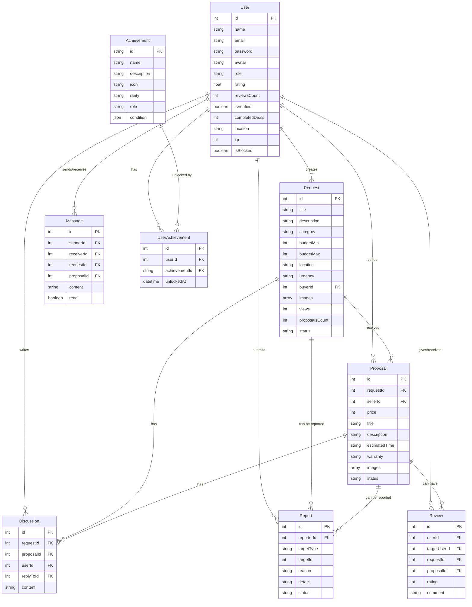

# Сутності та їх взаємодії

## Основні сутності

### 1. Account (Обліковий запис)

Один обліковий запис на користувача (один вхід: email + password). Не містить ролі чи рейтингу.

**Поля:**

- `id` - унікальний ідентифікатор
- `name` - ім'я
- `email` - email (унікальний)
- `password` - хеш пароля
- `avatar` - URL аватара
- `isAdmin` - чи адміністратор
- `isBlocked` - чи заблокований
- `blockedUntil` - до якої дати заблокований
- `createdAt`, `updatedAt`

### 2. Profile (Профіль)

У одного акаунта два профілі: **buyer** та **seller**. Кожен профіль має власний рейтинг, XP та досягнення.

**Поля:**

- `id` - унікальний ідентифікатор
- `accountId` - ID акаунта (foreign key до Account)
- `type` - тип профілю (buyer | seller)
- `rating` - середній рейтинг (0-5)
- `reviewsCount` - кількість відгуків
- `isVerified` - чи верифікований
- `memberSince` - дата створення профілю
- `completedDeals` - кількість завершених угод
- `location` - локація
- `xp` - досвід (XP) для гейміфікації
- `createdAt`, `updatedAt`

### 3. Request (Запит)

Запит на послугу від покупця.

**Поля:**

- `id` - унікальний ідентифікатор
- `title` - заголовок запиту
- `description` - детальний опис
- `category` - категорія (Електроніка, Дизайн, Освіта, тощо)
- `budgetMin` - мінімальний бюджет (грн)
- `budgetMax` - максимальний бюджет (грн)
- `location` - локація (місто або "Віддалено")
- `urgency` - терміновість (Гнучко, Протягом тижня, 2-3 дні, Терміново)
- `buyerId` - ID профілю покупця (foreign key до Profile, type=buyer)
- `images` - масив URL зображень
- `views` - кількість переглядів
- `proposalsCount` - кількість пропозицій
- `status` - статус (pending, active, closed, rejected)
- `edits` - масив історії редагувань (текст, timestamp)
- `createdAt` - дата створення
- `updatedAt` - дата оновлення

### 4. Proposal (Пропозиція)

Пропозиція від продавця на запит покупця.

**Поля:**

- `id` - унікальний ідентифікатор
- `requestId` - ID запиту (foreign key до Request)
- `sellerId` - ID профілю продавця (foreign key до Profile, type=seller)
- `price` - запропонована ціна (грн)
- `title` - заголовок пропозиції
- `description` - детальний опис послуги
- `estimatedTime` - термін виконання (1-2 дні, тиждень, тощо)
- `warranty` - гарантія (1 місяць, 3 місяці, тощо)
- `images` - масив URL зображень робіт продавця
- `status` - статус (pending, accepted, rejected, completed)
- `createdAt` - дата створення
- `updatedAt` - дата оновлення

### 5. Review (Відгук)

Відгук між користувачами після завершення угоди.

**Поля:**

- `id` - унікальний ідентифікатор
- `authorAccountId` - ID акаунта автора відгуку (foreign key до Account)
- `targetProfileId` - ID профілю, про який відгук (foreign key до Profile)
- `requestId` - ID запиту (foreign key до Request, опціонально)
- `proposalId` - ID пропозиції (foreign key до Proposal, опціонально)
- `rating` - оцінка (1-5)
- `comment` - текст відгуку
- `createdAt` - дата створення
- `updatedAt` - дата оновлення

### 6. Message (Повідомлення)

Повідомлення в чаті між користувачами.

**Поля:**

- `id` - унікальний ідентифікатор
- `senderId` - ID акаунта відправника (foreign key до Account)
- `receiverId` - ID акаунта отримувача (foreign key до Account)
- `requestId` - ID запиту, пов'язаного з чатом (foreign key до Request, опціонально)
- `proposalId` - ID пропозиції, пов'язаної з чатом (foreign key до Proposal, опціонально)
- `content` - текст повідомлення
- `read` - чи прочитано повідомлення
- `createdAt` - дата створення

### 6. Discussion (Обговорення)

Публічні коментарі під запитом або пропозицією.

**Поля:**

- `id` - унікальний ідентифікатор
- `requestId` - ID запиту (foreign key до Request, опціонально)
- `proposalId` - ID пропозиції (foreign key до Proposal, опціонально)
- `userId` - ID користувача, який залишив коментар (foreign key до User)
- `replyToId` - ID коментаря, на який відповідають (foreign key до Discussion, опціонально)
- `content` - текст коментаря
- `createdAt` - дата створення
- `updatedAt` - дата оновлення

### 7. BlogPost (Стаття блогу)

Статті в блозі платформи.

**Поля:**

- `id` - унікальний ідентифікатор
- `title` - заголовок статті
- `description` - короткий опис
- `content` - повний текст статті
- `category` - категорія статті
- `author` - автор статті
- `image` - URL зображення
- `readTime` - час читання (хвилини)
- `published` - чи опублікована стаття
- `createdAt` - дата створення
- `updatedAt` - дата оновлення

### 8. Report (Скарга)

Скарги на контент або користувачів.

**Поля:**

- `id` - унікальний ідентифікатор
- `reporterId` - ID користувача, який подал скаргу (foreign key до User)
- `targetType` - тип об'єкта (request, proposal, user, discussion)
- `targetId` - ID об'єкта, на який скарга
- `reason` - причина скарги (low-price, scam, inappropriate, spam, duplicate, other)
- `details` - додаткові деталі
- `status` - статус (pending, reviewed, resolved, rejected)
- `createdAt` - дата створення
- `updatedAt` - дата оновлення

### 9. Achievement (Досягнення)

Досягнення для гейміфікації.

**Поля:**

- `id` - унікальний ідентифікатор (string)
- `name` - назва досягнення
- `description` - опис
- `icon` - іконка (emoji або URL)
- `rarity` - рідкісність (common, rare, epic, legendary)
- `role` - для якої ролі (buyer, seller, both)
- `condition` - умова отримання (JSON)

### 10. UserAchievement (Досягнення користувача)

Зв'язок між користувачем та досягненням.

**Поля:**

- `id` - унікальний ідентифікатор
- `userId` - ID користувача (foreign key до User)
- `achievementId` - ID досягнення (foreign key до Achievement)
- `unlockedAt` - дата отримання

### 11. Category (Категорія)

Категорії для запитів та навігації. Підкатегорії реалізовані через `parentId` і масив `path` для швидкої побудови дерева.

**Поля:**

- `id` - унікальний ідентифікатор
- `name` - назва категорії
- `slug` - унікальний slug
- `parentId` - ID батьківської категорії (null для кореня)
- `path` - масив ID предків (від кореня до батька)
- `level` - рівень вкладеності
- `order` - порядок сортування
- `icon` - іконка (опціонально)
- `isActive` - чи активна категорія
- `createdAt` - дата створення
- `updatedAt` - дата оновлення

## Діаграма взаємодії сутностей

