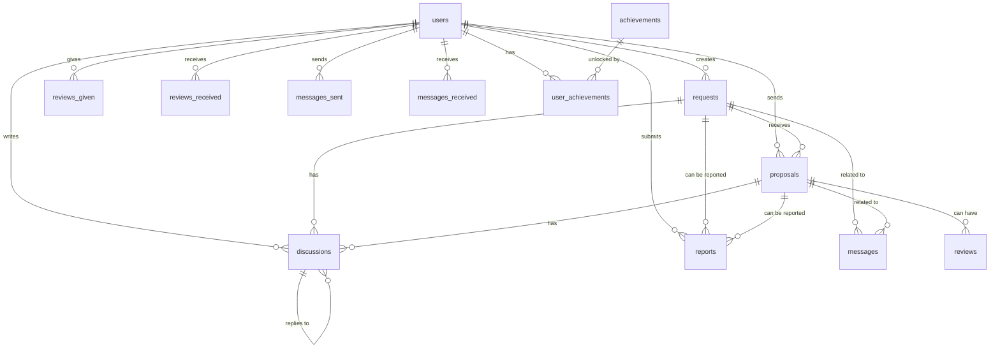

# Структура бази даних

## ER-діаграма

## Таблиці

### users

| Поле | Тип | Обмеження | Опис |
|------|-----|-----------|------|
| id | INT | PRIMARY KEY, AUTO_INCREMENT | Унікальний ідентифікатор |
| name | VARCHAR(255) | NOT NULL | Ім'я користувача |
| email | VARCHAR(255) | NOT NULL, UNIQUE | Email адреса |
| password | VARCHAR(255) | NOT NULL | Хеш пароля |
| avatar | VARCHAR(500) | NULL | URL аватара |
| role | ENUM('buyer', 'seller', 'admin') | NOT NULL, DEFAULT 'buyer' | Роль користувача |
| rating | DECIMAL(3,2) | DEFAULT 0.00 | Середній рейтинг (0-5) |
| reviews_count | INT | DEFAULT 0 | Кількість відгуків |
| is_verified | BOOLEAN | DEFAULT FALSE | Чи верифікований |
| member_since | DATE | NOT NULL | Дата реєстрації |
| completed_deals | INT | DEFAULT 0 | Кількість завершених угод |
| location | VARCHAR(255) | NULL | Локація |
| xp | INT | DEFAULT 0 | Досвід (experience points) |
| is_blocked | BOOLEAN | DEFAULT FALSE | Чи заблокований |
| blocked_until | DATETIME | NULL | Дата до якої заблокований |
| created_at | TIMESTAMP | DEFAULT CURRENT_TIMESTAMP | Дата створення |
| updated_at | TIMESTAMP | DEFAULT CURRENT_TIMESTAMP ON UPDATE CURRENT_TIMESTAMP | Дата оновлення |

**Індекси:**
- `idx_email` на `email`
- `idx_role` на `role`
- `idx_rating` на `rating`

### requests

| Поле | Тип | Обмеження | Опис |
|------|-----|-----------|------|
| id | INT | PRIMARY KEY, AUTO_INCREMENT | Унікальний ідентифікатор |
| title | VARCHAR(255) | NOT NULL | Заголовок запиту |
| description | TEXT | NOT NULL | Детальний опис |
| category | VARCHAR(100) | NOT NULL | Категорія |
| budget_min | DECIMAL(10,2) | NOT NULL | Мінімальний бюджет |
| budget_max | DECIMAL(10,2) | NOT NULL | Максимальний бюджет |
| location | VARCHAR(255) | NOT NULL | Локація |
| urgency | VARCHAR(50) | NOT NULL | Терміновість |
| buyer_id | INT | NOT NULL, FOREIGN KEY | ID покупця |
| images | JSON | NULL | Масив URL зображень |
| views | INT | DEFAULT 0 | Кількість переглядів |
| proposals_count | INT | DEFAULT 0 | Кількість пропозицій |
| status | ENUM('pending', 'active', 'closed', 'rejected') | DEFAULT 'pending' | Статус |
| edits | JSON | NULL | Історія редагувань |
| created_at | TIMESTAMP | DEFAULT CURRENT_TIMESTAMP | Дата створення |
| updated_at | TIMESTAMP | DEFAULT CURRENT_TIMESTAMP ON UPDATE CURRENT_TIMESTAMP | Дата оновлення |

**Індекси:**
- `idx_buyer_id` на `buyer_id`
- `idx_category` на `category`
- `idx_status` на `status`
- `idx_created_at` на `created_at`
- `FULLTEXT idx_search` на `title`, `description`

### proposals

| Поле | Тип | Обмеження | Опис |
|------|-----|-----------|------|
| id | INT | PRIMARY KEY, AUTO_INCREMENT | Унікальний ідентифікатор |
| request_id | INT | NOT NULL, FOREIGN KEY | ID запиту |
| seller_id | INT | NOT NULL, FOREIGN KEY | ID продавця |
| price | DECIMAL(10,2) | NOT NULL | Запропонована ціна |
| title | VARCHAR(255) | NOT NULL | Заголовок пропозиції |
| description | TEXT | NOT NULL | Детальний опис |
| estimated_time | VARCHAR(100) | NOT NULL | Термін виконання |
| warranty | VARCHAR(100) | NULL | Гарантія |
| images | JSON | NULL | Масив URL зображень |
| status | ENUM('pending', 'accepted', 'rejected', 'completed') | DEFAULT 'pending' | Статус |
| created_at | TIMESTAMP | DEFAULT CURRENT_TIMESTAMP | Дата створення |
| updated_at | TIMESTAMP | DEFAULT CURRENT_TIMESTAMP ON UPDATE CURRENT_TIMESTAMP | Дата оновлення |

**Індекси:**
- `idx_request_id` на `request_id`
- `idx_seller_id` на `seller_id`
- `idx_status` на `status`
- `idx_created_at` на `created_at`

### reviews

| Поле | Тип | Обмеження | Опис |
|------|-----|-----------|------|
| id | INT | PRIMARY KEY, AUTO_INCREMENT | Унікальний ідентифікатор |
| user_id | INT | NOT NULL, FOREIGN KEY | ID користувача, який залишив відгук |
| target_user_id | INT | NOT NULL, FOREIGN KEY | ID користувача, про якого відгук |
| request_id | INT | NULL, FOREIGN KEY | ID запиту |
| proposal_id | INT | NULL, FOREIGN KEY | ID пропозиції |
| rating | TINYINT | NOT NULL, CHECK (rating >= 1 AND rating <= 5) | Оцінка (1-5) |
| comment | TEXT | NULL | Текст відгуку |
| created_at | TIMESTAMP | DEFAULT CURRENT_TIMESTAMP | Дата створення |
| updated_at | TIMESTAMP | DEFAULT CURRENT_TIMESTAMP ON UPDATE CURRENT_TIMESTAMP | Дата оновлення |

**Індекси:**
- `idx_user_id` на `user_id`
- `idx_target_user_id` на `target_user_id`
- `idx_request_id` на `request_id`
- `idx_proposal_id` на `proposal_id`

### messages

| Поле | Тип | Обмеження | Опис |
|------|-----|-----------|------|
| id | INT | PRIMARY KEY, AUTO_INCREMENT | Унікальний ідентифікатор |
| sender_id | INT | NOT NULL, FOREIGN KEY | ID відправника |
| receiver_id | INT | NOT NULL, FOREIGN KEY | ID отримувача |
| request_id | INT | NULL, FOREIGN KEY | ID запиту |
| proposal_id | INT | NULL, FOREIGN KEY | ID пропозиції |
| content | TEXT | NOT NULL | Текст повідомлення |
| read | BOOLEAN | DEFAULT FALSE | Чи прочитано |
| created_at | TIMESTAMP | DEFAULT CURRENT_TIMESTAMP | Дата створення |

**Індекси:**
- `idx_sender_id` на `sender_id`
- `idx_receiver_id` на `receiver_id`
- `idx_request_id` на `request_id`
- `idx_proposal_id` на `proposal_id`
- `idx_created_at` на `created_at`

### discussions

| Поле | Тип | Обмеження | Опис |
|------|-----|-----------|------|
| id | INT | PRIMARY KEY, AUTO_INCREMENT | Унікальний ідентифікатор |
| request_id | INT | NULL, FOREIGN KEY | ID запиту |
| proposal_id | INT | NULL, FOREIGN KEY | ID пропозиції |
| user_id | INT | NOT NULL, FOREIGN KEY | ID користувача |
| reply_to_id | INT | NULL, FOREIGN KEY | ID коментаря, на який відповідають |
| content | TEXT | NOT NULL | Текст коментаря |
| created_at | TIMESTAMP | DEFAULT CURRENT_TIMESTAMP | Дата створення |
| updated_at | TIMESTAMP | DEFAULT CURRENT_TIMESTAMP ON UPDATE CURRENT_TIMESTAMP | Дата оновлення |

**Індекси:**
- `idx_request_id` на `request_id`
- `idx_proposal_id` на `proposal_id`
- `idx_user_id` на `user_id`
- `idx_reply_to_id` на `reply_to_id`

### reports

| Поле | Тип | Обмеження | Опис |
|------|-----|-----------|------|
| id | INT | PRIMARY KEY, AUTO_INCREMENT | Унікальний ідентифікатор |
| reporter_id | INT | NOT NULL, FOREIGN KEY | ID користувача, який подал скаргу |
| target_type | ENUM('request', 'proposal', 'user', 'discussion') | NOT NULL | Тип об'єкта |
| target_id | INT | NOT NULL | ID об'єкта |
| reason | ENUM('low-price', 'scam', 'inappropriate', 'spam', 'duplicate', 'other') | NOT NULL | Причина скарги |
| details | TEXT | NULL | Додаткові деталі |
| status | ENUM('pending', 'reviewed', 'resolved', 'rejected') | DEFAULT 'pending' | Статус |
| created_at | TIMESTAMP | DEFAULT CURRENT_TIMESTAMP | Дата створення |
| updated_at | TIMESTAMP | DEFAULT CURRENT_TIMESTAMP ON UPDATE CURRENT_TIMESTAMP | Дата оновлення |

**Індекси:**
- `idx_reporter_id` на `reporter_id`
- `idx_target` на `target_type`, `target_id`
- `idx_status` на `status`

### blog_posts

| Поле | Тип | Обмеження | Опис |
|------|-----|-----------|------|
| id | INT | PRIMARY KEY, AUTO_INCREMENT | Унікальний ідентифікатор |
| title | VARCHAR(255) | NOT NULL | Заголовок статті |
| description | TEXT | NOT NULL | Короткий опис |
| content | LONGTEXT | NOT NULL | Повний текст статті |
| category | VARCHAR(100) | NULL | Категорія статті |
| author | VARCHAR(255) | NOT NULL | Автор статті |
| image | VARCHAR(500) | NULL | URL зображення |
| read_time | INT | NULL | Час читання (хвилини) |
| published | BOOLEAN | DEFAULT FALSE | Чи опублікована |
| created_at | TIMESTAMP | DEFAULT CURRENT_TIMESTAMP | Дата створення |
| updated_at | TIMESTAMP | DEFAULT CURRENT_TIMESTAMP ON UPDATE CURRENT_TIMESTAMP | Дата оновлення |

**Індекси:**
- `idx_category` на `category`
- `idx_published` на `published`
- `idx_created_at` на `created_at`

### achievements

| Поле | Тип | Обмеження | Опис |
|------|-----|-----------|------|
| id | VARCHAR(50) | PRIMARY KEY | Унікальний ідентифікатор |
| name | VARCHAR(255) | NOT NULL | Назва досягнення |
| description | TEXT | NOT NULL | Опис |
| icon | VARCHAR(255) | NOT NULL | Іконка (emoji або URL) |
| rarity | ENUM('common', 'rare', 'epic', 'legendary') | NOT NULL | Рідкісність |
| role | ENUM('buyer', 'seller', 'both') | NOT NULL | Для якої ролі |
| condition | JSON | NOT NULL | Умова отримання |

### user_achievements

| Поле | Тип | Обмеження | Опис |
|------|-----|-----------|------|
| id | INT | PRIMARY KEY, AUTO_INCREMENT | Унікальний ідентифікатор |
| user_id | INT | NOT NULL, FOREIGN KEY | ID користувача |
| achievement_id | VARCHAR(50) | NOT NULL, FOREIGN KEY | ID досягнення |
| unlocked_at | TIMESTAMP | DEFAULT CURRENT_TIMESTAMP | Дата отримання |

**Індекси:**
- `idx_user_id` на `user_id`
- `idx_achievement_id` на `achievement_id`
- `UNIQUE idx_user_achievement` на `user_id`, `achievement_id`
