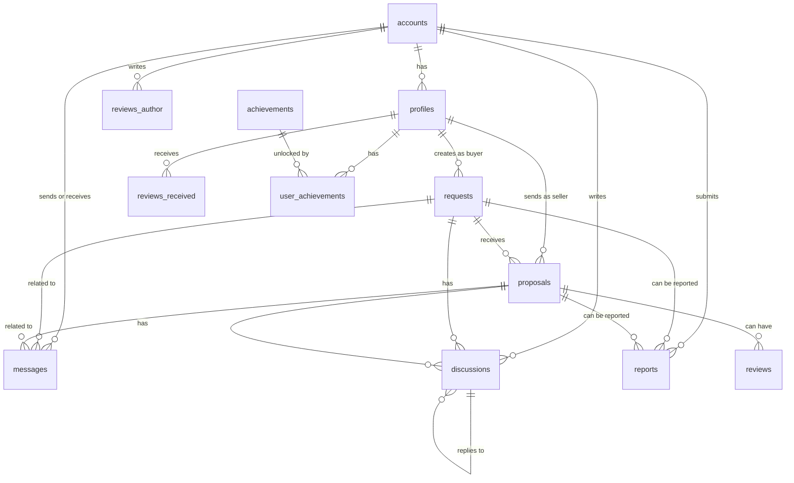

# Структура бази даних

## ER-діаграма

## Таблиці (MongoDB колекції / Mongoose)

Реалізація на MongoDB (Mongoose). Нижче — логічні поля та зв'язки.

### accounts

| Поле         | Тип      | Обмеження        | Опис                      |
| ------------ | -------- | ---------------- | ------------------------- |
| \_id         | ObjectId | PRIMARY KEY      | Унікальний ідентифікатор  |
| name         | String   | required         | Ім'я                      |
| email        | String   | required, unique | Email                     |
| password     | String   | required         | Хеш пароля                |
| avatar       | String   | optional         | URL аватара               |
| isAdmin      | Boolean  | default false    | Чи адміністратор          |
| isBlocked    | Boolean  | default false    | Чи заблокований           |
| blockedUntil | Date     | optional         | До якої дати заблокований |
| createdAt    | Date     |                  | Дата створення            |
| updatedAt    | Date     |                  | Дата оновлення            |

**Індекси:** email (unique).

### profiles

| Поле           | Тип      | Обмеження           | Опис                      |
| -------------- | -------- | ------------------- | ------------------------- |
| \_id           | ObjectId | PRIMARY KEY         | Унікальний ідентифікатор  |
| accountId      | ObjectId | ref: Account        | ID акаунта                |
| type           | String   | enum: buyer, seller | Тип профілю               |
| rating         | Number   | default 0           | Середній рейтинг (0-5)    |
| reviewsCount   | Number   | default 0           | Кількість відгуків        |
| completedDeals | Number   | default 0           | Кількість завершених угод |
| xp             | Number   | default 0           | Досвід (XP)               |
| location       | String   | optional            | Локація                   |
| memberSince    | Date     |                     | Дата реєстрації профілю   |
| isVerified     | Boolean  | default false       | Чи верифікований          |
| createdAt      | Date     |                     | Дата створення            |
| updatedAt      | Date     |                     | Дата оновлення            |

**Індекси:** (accountId, type) unique; type; rating; xp.

### requests

| Поле            | Тип                                             | Обмеження                                             | Опис                     |
| --------------- | ----------------------------------------------- | ----------------------------------------------------- | ------------------------ |
| id              | INT                                             | PRIMARY KEY, AUTO_INCREMENT                           | Унікальний ідентифікатор |
| title           | VARCHAR(255)                                    | NOT NULL                                              | Заголовок запиту         |
| description     | TEXT                                            | NOT NULL                                              | Детальний опис           |
| category        | VARCHAR(100)                                    | NOT NULL                                              | Категорія                |
| budget_min      | DECIMAL(10,2)                                   | NOT NULL                                              | Мінімальний бюджет       |
| budget_max      | DECIMAL(10,2)                                   | NOT NULL                                              | Максимальний бюджет      |
| location        | VARCHAR(255)                                    | NOT NULL                                              | Локація                  |
| urgency         | VARCHAR(50)                                     | NOT NULL                                              | Терміновість             |
| buyerId         | ObjectId                                        | NOT NULL, ref: Profile (type=buyer)                   | ID профілю покупця       |
| images          | JSON                                            | NULL                                                  | Масив URL зображень      |
| views           | INT                                             | DEFAULT 0                                             | Кількість переглядів     |
| proposals_count | INT                                             | DEFAULT 0                                             | Кількість пропозицій     |
| status          | ENUM('pending', 'active', 'closed', 'rejected') | DEFAULT 'pending'                                     | Статус                   |
| edits           | JSON                                            | NULL                                                  | Історія редагувань       |
| created_at      | TIMESTAMP                                       | DEFAULT CURRENT_TIMESTAMP                             | Дата створення           |
| updated_at      | TIMESTAMP                                       | DEFAULT CURRENT_TIMESTAMP ON UPDATE CURRENT_TIMESTAMP | Дата оновлення           |

**Індекси:**

- `idx_buyerId` на `buyerId`
- `idx_category` на `category`
- `idx_status` на `status`
- `idx_created_at` на `created_at`
- `FULLTEXT idx_search` на `title`, `description`

### proposals

| Поле           | Тип                                                  | Обмеження                                             | Опис                     |
| -------------- | ---------------------------------------------------- | ----------------------------------------------------- | ------------------------ |
| id             | INT                                                  | PRIMARY KEY, AUTO_INCREMENT                           | Унікальний ідентифікатор |
| request_id     | INT                                                  | NOT NULL, FOREIGN KEY                                 | ID запиту                |
| sellerId       | ObjectId                                             | NOT NULL, ref: Profile (type=seller)                  | ID профілю продавця      |
| price          | DECIMAL(10,2)                                        | NOT NULL                                              | Запропонована ціна       |
| title          | VARCHAR(255)                                         | NOT NULL                                              | Заголовок пропозиції     |
| description    | TEXT                                                 | NOT NULL                                              | Детальний опис           |
| estimated_time | VARCHAR(100)                                         | NOT NULL                                              | Термін виконання         |
| warranty       | VARCHAR(100)                                         | NULL                                                  | Гарантія                 |
| images         | JSON                                                 | NULL                                                  | Масив URL зображень      |
| status         | ENUM('pending', 'accepted', 'rejected', 'completed') | DEFAULT 'pending'                                     | Статус                   |
| created_at     | TIMESTAMP                                            | DEFAULT CURRENT_TIMESTAMP                             | Дата створення           |
| updated_at     | TIMESTAMP                                            | DEFAULT CURRENT_TIMESTAMP ON UPDATE CURRENT_TIMESTAMP | Дата оновлення           |

**Індекси:**

- `idx_request_id` на `request_id`
- `idx_sellerId` на `sellerId`
- `idx_status` на `status`
- `idx_created_at` на `created_at`

### reviews

| Поле            | Тип       | Обмеження                                             | Опис                        |
| --------------- | --------- | ----------------------------------------------------- | --------------------------- |
| id              | INT       | PRIMARY KEY, AUTO_INCREMENT                           | Унікальний ідентифікатор    |
| authorAccountId | ObjectId  | NOT NULL, ref: Account                                | ID акаунта автора відгуку   |
| targetProfileId | ObjectId  | NOT NULL, ref: Profile                                | ID профілю, про який відгук |
| request_id      | INT       | NULL, FOREIGN KEY                                     | ID запиту                   |
| proposal_id     | INT       | NULL, FOREIGN KEY                                     | ID пропозиції               |
| rating          | TINYINT   | NOT NULL, CHECK (rating >= 1 AND rating <= 5)         | Оцінка (1-5)                |
| comment         | TEXT      | NULL                                                  | Текст відгуку               |
| created_at      | TIMESTAMP | DEFAULT CURRENT_TIMESTAMP                             | Дата створення              |
| updated_at      | TIMESTAMP | DEFAULT CURRENT_TIMESTAMP ON UPDATE CURRENT_TIMESTAMP | Дата оновлення              |

**Індекси:**

- `idx_authorAccountId` на `authorAccountId`
- `idx_targetProfileId` на `targetProfileId`
- `idx_requestId` на `requestId`
- `idx_proposalId` на `proposalId`

### messages

| Поле        | Тип       | Обмеження                   | Опис                     |
| ----------- | --------- | --------------------------- | ------------------------ |
| id          | INT       | PRIMARY KEY, AUTO_INCREMENT | Унікальний ідентифікатор |
| senderId    | ObjectId  | NOT NULL, ref: Account      | ID акаунта відправника   |
| receiverId  | ObjectId  | NOT NULL, ref: Account      | ID акаунта отримувача    |
| request_id  | INT       | NULL, FOREIGN KEY           | ID запиту                |
| proposal_id | INT       | NULL, FOREIGN KEY           | ID пропозиції            |
| content     | TEXT      | NOT NULL                    | Текст повідомлення       |
| read        | BOOLEAN   | DEFAULT FALSE               | Чи прочитано             |
| created_at  | TIMESTAMP | DEFAULT CURRENT_TIMESTAMP   | Дата створення           |

**Індекси:**

- `idx_senderId` на `senderId`
- `idx_receiverId` на `receiverId`
- `idx_requestId` на `requestId`
- `idx_proposalId` на `proposalId`
- `idx_created_at` на `created_at`

### discussions

| Поле        | Тип       | Обмеження                                             | Опис                               |
| ----------- | --------- | ----------------------------------------------------- | ---------------------------------- |
| id          | INT       | PRIMARY KEY, AUTO_INCREMENT                           | Унікальний ідентифікатор           |
| request_id  | INT       | NULL, FOREIGN KEY                                     | ID запиту                          |
| proposal_id | INT       | NULL, FOREIGN KEY                                     | ID пропозиції                      |
| accountId   | ObjectId  | NOT NULL, ref: Account                                | ID акаунта                         |
| reply_to_id | INT       | NULL, FOREIGN KEY                                     | ID коментаря, на який відповідають |
| content     | TEXT      | NOT NULL                                              | Текст коментаря                    |
| created_at  | TIMESTAMP | DEFAULT CURRENT_TIMESTAMP                             | Дата створення                     |
| updated_at  | TIMESTAMP | DEFAULT CURRENT_TIMESTAMP ON UPDATE CURRENT_TIMESTAMP | Дата оновлення                     |

**Індекси:**

- `idx_requestId` на `requestId`
- `idx_proposalId` на `proposalId`
- `idx_accountId` на `accountId`
- `idx_replyToId` на `replyToId`

### reports

| Поле        | Тип                                                                      | Обмеження                                             | Опис                          |
| ----------- | ------------------------------------------------------------------------ | ----------------------------------------------------- | ----------------------------- |
| id          | INT                                                                      | PRIMARY KEY, AUTO_INCREMENT                           | Унікальний ідентифікатор      |
| reporterId  | ObjectId                                                                 | NOT NULL, ref: Account                                | ID акаунта, який подав скаргу |
| target_type | ENUM('request', 'proposal', 'user', 'discussion')                        | NOT NULL                                              | Тип об'єкта                   |
| target_id   | INT                                                                      | NOT NULL                                              | ID об'єкта                    |
| reason      | ENUM('low-price', 'scam', 'inappropriate', 'spam', 'duplicate', 'other') | NOT NULL                                              | Причина скарги                |
| details     | TEXT                                                                     | NULL                                                  | Додаткові деталі              |
| status      | ENUM('pending', 'reviewed', 'resolved', 'rejected')                      | DEFAULT 'pending'                                     | Статус                        |
| created_at  | TIMESTAMP                                                                | DEFAULT CURRENT_TIMESTAMP                             | Дата створення                |
| updated_at  | TIMESTAMP                                                                | DEFAULT CURRENT_TIMESTAMP ON UPDATE CURRENT_TIMESTAMP | Дата оновлення                |

**Індекси:**

- `idx_reporterId` на `reporterId`
- `idx_target` на `target_type`, `target_id`
- `idx_status` на `status`

### blog_posts

| Поле        | Тип          | Обмеження                                             | Опис                     |
| ----------- | ------------ | ----------------------------------------------------- | ------------------------ |
| id          | INT          | PRIMARY KEY, AUTO_INCREMENT                           | Унікальний ідентифікатор |
| title       | VARCHAR(255) | NOT NULL                                              | Заголовок статті         |
| description | TEXT         | NOT NULL                                              | Короткий опис            |
| content     | LONGTEXT     | NOT NULL                                              | Повний текст статті      |
| category    | VARCHAR(100) | NULL                                                  | Категорія статті         |
| author      | VARCHAR(255) | NOT NULL                                              | Автор статті             |
| image       | VARCHAR(500) | NULL                                                  | URL зображення           |
| read_time   | INT          | NULL                                                  | Час читання (хвилини)    |
| published   | BOOLEAN      | DEFAULT FALSE                                         | Чи опублікована          |
| created_at  | TIMESTAMP    | DEFAULT CURRENT_TIMESTAMP                             | Дата створення           |
| updated_at  | TIMESTAMP    | DEFAULT CURRENT_TIMESTAMP ON UPDATE CURRENT_TIMESTAMP | Дата оновлення           |

**Індекси:**

- `idx_category` на `category`
- `idx_published` на `published`
- `idx_created_at` на `created_at`

### achievements

| Поле        | Тип                                         | Обмеження   | Опис                     |
| ----------- | ------------------------------------------- | ----------- | ------------------------ |
| id          | VARCHAR(50)                                 | PRIMARY KEY | Унікальний ідентифікатор |
| name        | VARCHAR(255)                                | NOT NULL    | Назва досягнення         |
| description | TEXT                                        | NOT NULL    | Опис                     |
| icon        | VARCHAR(255)                                | NOT NULL    | Іконка (emoji або URL)   |
| rarity      | ENUM('common', 'rare', 'epic', 'legendary') | NOT NULL    | Рідкісність              |
| role        | ENUM('buyer', 'seller', 'both')             | NOT NULL    | Для якої ролі            |
| condition   | JSON                                        | NOT NULL    | Умова отримання          |

### user_achievements

| Поле           | Тип         | Обмеження                   | Опис                     |
| -------------- | ----------- | --------------------------- | ------------------------ |
| id             | INT         | PRIMARY KEY, AUTO_INCREMENT | Унікальний ідентифікатор |
| profileId      | ObjectId    | NOT NULL, ref: Profile      | ID профілю               |
| achievement_id | VARCHAR(50) | NOT NULL, FOREIGN KEY       | ID досягнення            |
| unlocked_at    | TIMESTAMP   | DEFAULT CURRENT_TIMESTAMP   | Дата отримання           |

**Індекси:**

- `idx_profileId` на `profileId`
- `idx_achievementId` на `achievement_id`
- `UNIQUE idx_profile_achievement` на `profileId`, `achievement_id`

### categories

| Поле       | Тип              | Обмеження                                             | Опис                      |
| ---------- | ---------------- | ----------------------------------------------------- | ------------------------- |
| id         | OBJECT_ID        | PRIMARY KEY                                           | Унікальний ідентифікатор  |
| name       | VARCHAR(255)     | NOT NULL                                              | Назва категорії           |
| slug       | VARCHAR(255)     | NOT NULL, UNIQUE                                      | Унікальний slug           |
| parent_id  | OBJECT_ID        | NULL                                                  | ID батьківської категорії |
| path       | ARRAY<OBJECT_ID> | DEFAULT []                                            | Масив ID предків          |
| level      | INT              | DEFAULT 0                                             | Рівень вкладеності        |
| order      | INT              | DEFAULT 0                                             | Порядок сортування        |
| icon       | VARCHAR(255)     | NULL                                                  | Іконка                    |
| is_active  | BOOLEAN          | DEFAULT TRUE                                          | Чи активна                |
| created_at | TIMESTAMP        | DEFAULT CURRENT_TIMESTAMP                             | Дата створення            |
| updated_at | TIMESTAMP        | DEFAULT CURRENT_TIMESTAMP ON UPDATE CURRENT_TIMESTAMP | Дата оновлення            |

**Індекси:**

- `idx_slug` на `slug` (unique)
- `idx_parent_id_order` на `parent_id`, `order`
- `idx_path` на `path`
- `idx_level` на `level`
- `idx_is_active` на `is_active`
