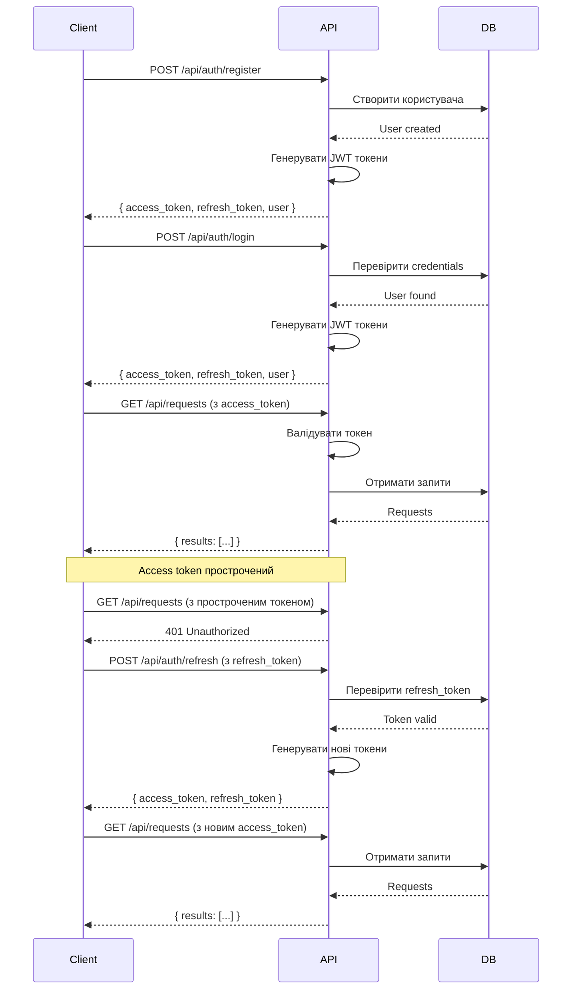

# Аутентифікація та авторизація

## JWT Токени

Платформа використовує JWT (JSON Web Tokens) для аутентифікації.

### Access Token

- **Тривалість:** 15 хвилин
- **Використання:** Відправляється в заголовку `Authorization: Bearer <access_token>`
- **Містить:** user_id, email, role

### Refresh Token

- **Тривалість:** 7 днів
- **Зберігання:** В базі даних (таблиця `refresh_tokens`)
- **Використання:** Для отримання нового access token

## Механізм оновлення токенів

1. Користувач робить запит з access token
2. Якщо access token прострочений, сервер повертає `401 Unauthorized`
3. Фронтенд відправляє refresh token на `/api/auth/refresh`
4. Сервер перевіряє refresh token та видає нові access та refresh токени
5. Фронтенд повторює оригінальний запит з новим access token

## Захищені routes

Деякі endpoints вимагають авторизації:
- Створення/редагування/видалення запитів
- Створення пропозицій
- Оновлення профілю
- Відправка повідомлень
- Залишення відгуків
- Адмін функції

## Ролі користувачів

- **buyer** - може створювати запити, приймати пропозиції
- **seller** - може надсилати пропозиції
- **admin** - має доступ до адмін панелі та модерації

## Діаграма flow авторизації

