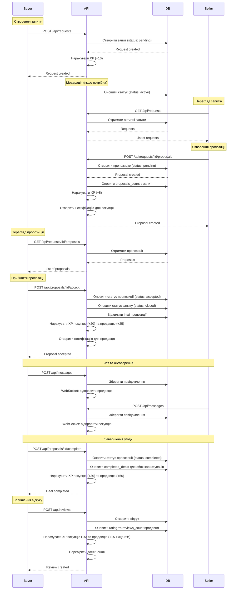

# Діаграми flow та workflows

## Діаграма flow створення запиту → пропозиції → угоди

```mermaid
sequenceDiagram
    participant Buyer
    participant API
    participant DB
    participant Seller
    
    Note over Buyer: Створення запиту
    Buyer->>API: POST /api/requests
    API->>DB: Створити запит (status: pending)
    DB-->>API: Request created
    API->>API: Нарахувати XP (+10)
    API-->>Buyer: Request created
    
    Note over API: Модерація (якщо потрібна)
    API->>DB: Оновити статус (status: active)
    
    Note over Seller: Перегляд запитів
    Seller->>API: GET /api/requests
    API->>DB: Отримати активні запити
    DB-->>API: Requests
    API-->>Seller: List of requests
    
    Note over Seller: Створення пропозиції
    Seller->>API: POST /api/requests/:id/proposals
    API->>DB: Створити пропозицію (status: pending)
    DB-->>API: Proposal created
    API->>DB: Оновити proposals_count в запиті
    API->>API: Нарахувати XP (+5)
    API->>API: Створити нотифікацію для покупця
    API-->>Seller: Proposal created
    
    Note over Buyer: Перегляд пропозицій
    Buyer->>API: GET /api/requests/:id/proposals
    API->>DB: Отримати пропозиції
    DB-->>API: Proposals
    API-->>Buyer: List of proposals
    
    Note over Buyer: Прийняття пропозиції
    Buyer->>API: POST /api/proposals/:id/accept
    API->>DB: Оновити статус пропозиції (status: accepted)
    API->>DB: Оновити статус запиту (status: closed)
    API->>DB: Відхилити інші пропозиції
    API->>API: Нарахувати XP покупцю (+20) та продавцю (+25)
    API->>API: Створити нотифікацію для продавця
    API-->>Buyer: Proposal accepted
    
    Note over Buyer,Seller: Чат та обговорення
    Buyer->>API: POST /api/messages
    API->>DB: Зберегти повідомлення
    API->>API: WebSocket: відправити продавцю
    Seller->>API: POST /api/messages
    API->>DB: Зберегти повідомлення
    API->>API: WebSocket: відправити покупцю
    
    Note over Buyer,Seller: Завершення угоди
    Buyer->>API: POST /api/proposals/:id/complete
    API->>DB: Оновити статус пропозиції (status: completed)
    API->>DB: Оновити completed_deals для обох користувачів
    API->>API: Нарахувати XP покупцю (+30) та продавцю (+50)
    API-->>Buyer: Deal completed
    
    Note over Buyer: Залишення відгуку
    Buyer->>API: POST /api/reviews
    API->>DB: Створити відгук
    API->>DB: Оновити rating та reviews_count продавця
    API->>API: Нарахувати XP покупцю (+5) та продавцю (+15 якщо 5★)
    API->>API: Перевірити досягнення
    API-->>Buyer: Review created
```
