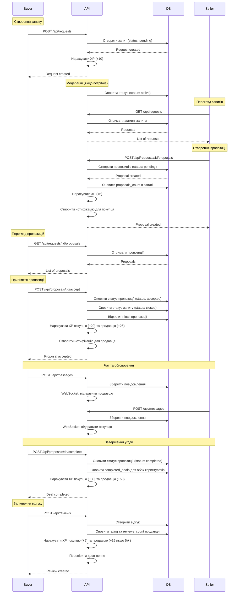

# Діаграми flow та workflows

## Діаграма flow створення запиту → пропозиції → угоди

## Статуси запитів (RequestStatus)

У схемі `RequestStatus` використовуються такі значення:

- **`PENDING`**
  - **Значення**: запит створений, але ще не доступний у публічному списку (може використовуватися для модерації). У поточній реалізації нові запити одразу створюються як `ACTIVE`.
  - **Дозволені дії**:
    - Покупець може редагувати запит (`PATCH /api/requests/:id`).
    - Покупець може скасувати запит (`PATCH /api/requests/:id/cancel`).
  - **Можливі наступні статуси**:
    - `ACTIVE` — після затвердження/автоматичного переходу.
    - `CANCELLED` — якщо власник скасував до публікації.
    - `REJECTED` — якщо адмін відхилив запит.
  - **API-приклади**:
    - Створення запиту:
      - `POST /api/requests`

- **`ACTIVE`**
  - **Значення**: запит опублікований, видимий в списках, приймає нові пропозиції.
  - **Дозволені дії**:
    - Продавці можуть створювати пропозиції:
      - `POST /api/requests/:id/proposals`
    - Покупець може редагувати запит:
      - `PATCH /api/requests/:id`
    - Покупець може скасувати запит:
      - `PATCH /api/requests/:id/cancel`
  - **Можливі наступні статуси**:
    - `CLOSED` — коли покупець прийняв одну з пропозицій (`POST /api/proposals/:proposalId/accept`).
    - `CANCELLED` — коли власник запиту скасовує оголошення (`PATCH /api/requests/:id/cancel`).
    - `REJECTED` — якщо модерація/адмін відхиляє запит.

- **`CLOSED`**
  - **Значення**: за цим запитом вже обрано пропозицію, нові пропозиції більше не приймаються. Запит все ще може бути «в процесі» (очікується передача товару).
  - **Дозволені дії**:
    - Створювати нові пропозиції **не можна** — `GET /api/requests` за замовчуванням повертає лише `ACTIVE`.
    - Редагування запиту заборонено в сервісі:
      - спроба `PATCH /api/requests/:id` призведе до помилки, якщо статус `CLOSED`.
  - **Можливі наступні статуси**:
    - (Концептуально) `COMPLETED` — після повного завершення угоди й отримання товару.
    - Фактичний перехід завершення угоди зараз фіксується на рівні `Proposal` (`COMPLETED`), а статус запиту залишається `CLOSED`.
    - `ACTIVE` — якщо покупець скасував уже прийняту пропозицію через `POST /api/proposals/:id/cancel` (запит знову відкритий до нових пропозицій).

- **`COMPLETED`**
  - **Значення**: запит повністю реалізований, угода по ньому завершена. У поточній реалізації основний факт завершення угоди зберігається в статусі пропозиції (`ProposalStatus.COMPLETED`), але цей статус зарезервований під можливий майбутній більш точний відблиск стану на рівні запиту.
  - **Дозволені дії**:
    - Запит використовується для історії та аналітики.
    - Нові пропозиції та редагування змісту запиту не допускаються (на рівні бізнес-логіки).
  - **Можливі наступні статуси**:
    - Термінальний стан, інші переходи не очікуються.

- **`CANCELLED`**
  - **Значення**: власник запиту скасував його до укладання угоди (або система/адмін помітили, що він більше не актуальний).
  - **Дозволені дії**:
    - Запит доступний лише для перегляду в історії.
    - Спроба повторно скасувати поверне помилку:
      - `PATCH /api/requests/:id/cancel` для вже `CANCELLED` / `CLOSED` / `COMPLETED` викликає помилку валідації.
  - **Можливі наступні статуси**:
    - Термінальний стан.
  - **API-приклади**:
    - Скасування запиту власником:
      - `PATCH /api/requests/:id/cancel`

- **`REJECTED`**
  - **Значення**: запит відхилено модерацією/адміном (наприклад, порушення правил або спам).
  - **Дозволені дії**:
    - Показувати користувачу причину відхилення (за потреби – через окремі поля/нотифікації).
    - Нові пропозиції не приймаються.
  - **Можливі наступні статуси**:
    - Зазвичай термінальний; можливий ручний перехід в `ACTIVE` після виправлення, якщо така бізнес-логіка з’явиться.

## Статуси пропозицій (ProposalStatus)

У схемі `ProposalStatus` використовуються такі значення:

- **`PENDING`**
  - **Значення**: пропозиція створена продавцем і очікує рішення покупця.
  - **Дозволені дії**:
    - Продавець може оновлювати зміст пропозиції:
      - `PATCH /api/proposals/:id`
    - Продавець може відкликати пропозицію:
      - `POST /api/proposals/:id/withdraw`
    - Покупець (власник запиту) може:
      - прийняти пропозицію: `POST /api/proposals/:id/accept`
      - відхилити пропозицію: `POST /api/proposals/:id/reject`
  - **Можливі наступні статуси**:
    - `ACCEPTED` — при прийнятті покупцем.
    - `REJECTED` — при відхиленні покупцем.
    - `WITHDRAWN` — при відкликанні продавцем.

- **`ACCEPTED`**
  - **Значення**: покупець обрав цю пропозицію, угода в процесі (сторони домовляються про передачу товару). При цьому:
    - ця пропозиція отримує статус `ACCEPTED`;
    - інші `PENDING` пропозиції по цьому запиту автоматично стають `REJECTED`;
    - запит (`Request`) отримує статус `CLOSED`.
  - **Дозволені дії**:
    - Покупець може завершити угоду (після того, як реально отримав товар):
      - `POST /api/proposals/:id/complete`
    - Інші зміни статусу (ще одна `accept`/`reject`/`withdraw`) для цієї пропозиції не допускаються.
  - **Можливі наступні статуси**:
    - `COMPLETED` — після успішного завершення угоди (`POST /api/proposals/:id/complete`).
    - `REJECTED` — якщо покупець скасував раніше прийняту пропозицію (`POST /api/proposals/:id/cancel`), при цьому пов’язаний `Request` стає знову `ACTIVE`.

  - **API-приклади**:
    - Скасування вже прийнятої пропозиції та повторне відкриття запиту:
      - `POST /api/proposals/:id/cancel`

- **`COMPLETED`**
  - **Значення**: угода за цією пропозицією успішно завершена, товар передано, можна залишати відгуки.
  - **Дозволені дії**:
    - Покупець і продавець можуть залишати відгуки:
      - `POST /api/reviews` (з вказаним `proposalId`)
    - Статистика (`completedDeals`, XP, досягнення) оновлюється в `ProposalsService.complete` та `ReviewsService`.
  - **Можливі наступні статуси**:
    - Термінальний стан.

- **`REJECTED`**
  - **Значення**: пропозиція була відхилена покупцем (власником запиту) або автоматично відхилена при прийнятті іншої пропозиції.
  - **Дозволені дії**:
    - Пропозиція використовується для історії та аналітики.
    - Повторно змінювати статус (`accept`, `withdraw`, `complete`) не можна.
  - **Можливі наступні статуси**:
    - Термінальний стан.
  - **API-приклади**:
    - Ручне відхилення покупцем:
      - `POST /api/proposals/:id/reject`

- **`WITHDRAWN`**
  - **Значення**: продавець сам відкликав свою пропозицію, поки вона була у стані `PENDING`.
  - **Дозволені дії**:
    - Пропозиція використовується лише в історії.
    - В `ProposalsService.canPropose` продавцю заборонено створювати нову пропозицію до цього ж запиту, якщо раніше він вже подавав і відкликав (логіка перевірки `ALREADY_PROPOSED`).
  - **Можливі наступні статуси**:
    - Термінальний стан.
  - **API-приклади**:
    - Відкликання пропозиції продавцем:
      - `POST /api/proposals/:id/withdraw`

## Загальна логіка відгуків

- Відгук (`Review`) можна створити **тільки** для пропозиції зі статусом `COMPLETED`.
- У `ReviewsService` це перевіряється умовою:
  - `proposal.status === ProposalStatus.COMPLETED` — інакше повертається помилка («Can only review completed proposals»).
- Відгуки прив’яані до `proposalId` і `targetProfileId`, тому:
  - неможливо залишити відгук по скасованій, відхиленій або відкликаній пропозиції;
  - неможливо залишити відгук, якщо користувач не є учасником цієї угоди (перевірка автора в сервісі).
